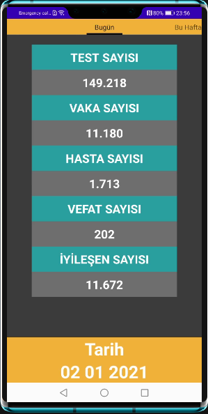
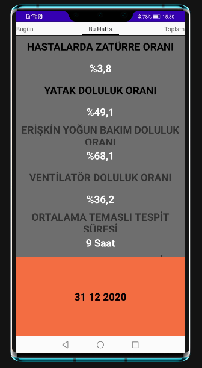
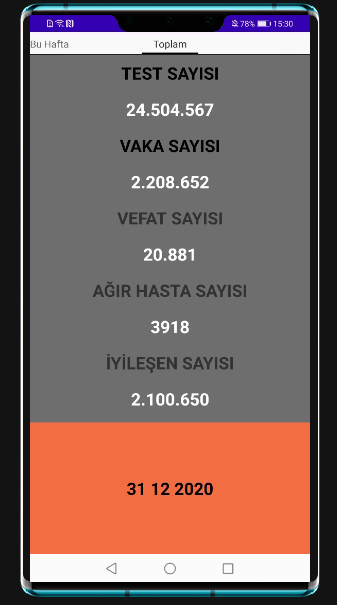
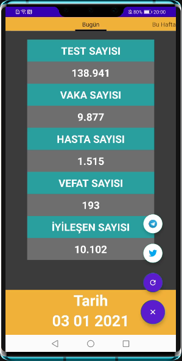

# turkuazgrafik_app
> Günlük korona tablosu andorid uygulaması.


Türkiye Cumhuriyeti Sağlık Bakanlığı tarafından yayınlanan korona hasta tablosu yayınlandığında bildirim gönderen ve son yayımlanan hasta tablosunu tablosunu gösteren ugulamadır. 

   

## Kurulum

Uygulamayı indirip andoid studio ile açabilirsiniz.
```sh
git clone https://github.com/icetin-yu/turkuazgrafik_app.git
```


## Uygulana kullanımı

turkuazgrafik_app 3 ana pencereden oluşmaktadır. Bugün, Bu hafta, Toplam olacak şekilde resimlere gösterildiği gibidir. Sayfalar arasında sürüklüyerek geçiş yapabilirsiniz.
turkuazgrafik_app sizin için, linux tabanlı bir server tarafından tablo yayınlandığı gibi size bildirim gönderecektir.
Push notification almak için Huawei Mobil Service kurulu olmalıdır.

##
Turkuaz grafik diğer:

Twitter - [@trturkuazgrafik](https://twitter.com/trturkuazgrafik) – Telegram https://t.me/turkuazgrafik


## Release History

* 0.1.0
    * Work in progress
    * Add: mainactivity, fragments, layouts
* 0.0.1
    * Work in progress

## Meta

İsrafil ÇETİN – Twitter [@icetin_](https://twitter.com/icetin_) – icetin93@gmail.com.com


[https://github.com/yourname/github-link](https://github.com/dbader/)

## Contributing

1. Fork it (<https://github.com/icetin-yu/turkuazgrafik_app/fork>)
2. Create your feature branch (`git checkout -b feature/fooBar`)
3. Commit your changes (`git commit -am 'Add some fooBar'`)
4. Push to the branch (`git push origin feature/fooBar`)
5. Create a new Pull Request

